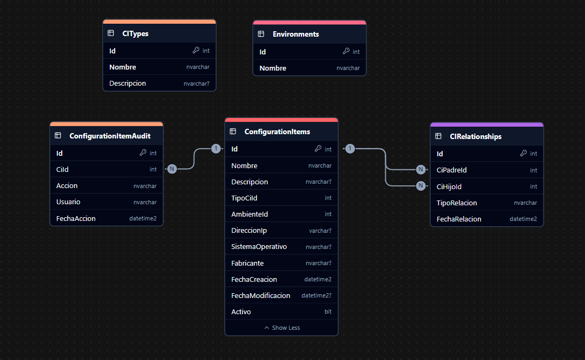
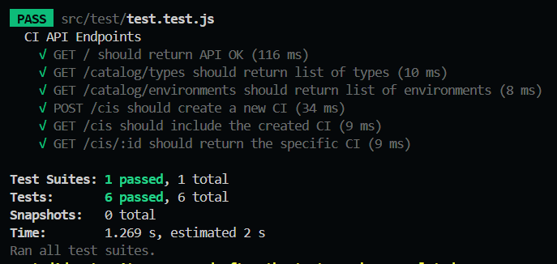

# SOFTWARE AVANZADO - Tarea 3
## Marco Antonio Solis Gonzalez 
## 202003220


# Scripts de base de datos
Para preparar la base de datos **Tarea3**

- [ddl.sql](./db/ddl.sql) 
- [seed.sql](./db/seed.sql) 

## Modelo Relacional de la base de datos



# Configuracion de la API
Debemos definir el .env
```env
DB_USER=
DB_PASSWORD=
DB_SERVER=localhost
DB_DATABASE=Tarea3
DB_PORT=1433
PORT=3000
```

Debemos de instalra las dependencias
```bash
npm install
```

Por ultimo para correr el servidor se ejecuta
```bash
npm run dev
```

## ENDPOINTS Realizados

### 1. Catálogos

| Método | Ruta                         | Descripción                        |
| ------ | ---------------------------- | ---------------------------------- |
| GET    | `/catalog/types`             | Lista todos los tipos de CI        |
| GET    | `/catalog/environments`      | Lista todos los ambientes          |

### 2. Configuration Items (CIs)

| Método | Ruta                  | Query Params                  | Body (JSON)                                                                           | Descripción                                         |
| ------ | --------------------- | ----------------------------- | -------------------------------------------------------------------------------------- | --------------------------------------------------- |
| GET    | `/cis`                | `tipo`, `env`, `nombre`      | —                                                                                      | Lista CIs filtrables por tipo, ambiente o nombre     |
| GET    | `/cis/:id`            | —                             | —                                                                                      | Obtiene un CI por su ID                              |
| POST   | `/cis`                | —                             | `{ nombre, descripcion, tipoId, ambienteId, ip, so, fabricante }`                      | Crea un nuevo CI                                      |
| PUT    | `/cis/:id`            | —                             | `{ nombre, descripcion, tipoId, ambienteId, ip, so, fabricante }`                      | Actualiza un CI existente                            |
| DELETE | `/cis/:id`            | —                             | —                                                                                      | Elimina (lógico) un CI (Activo = 0)                  |


# Tests Automatizados
Para correr los test automatizados primero debemos de ejecutar el siguiente comando

```bash
npm test
```

Nos mostrara el siguiente resultado
